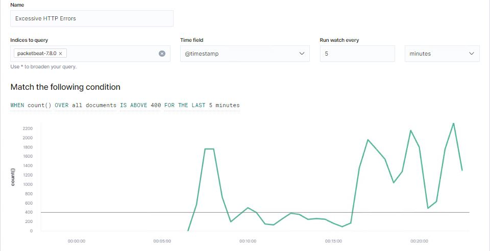
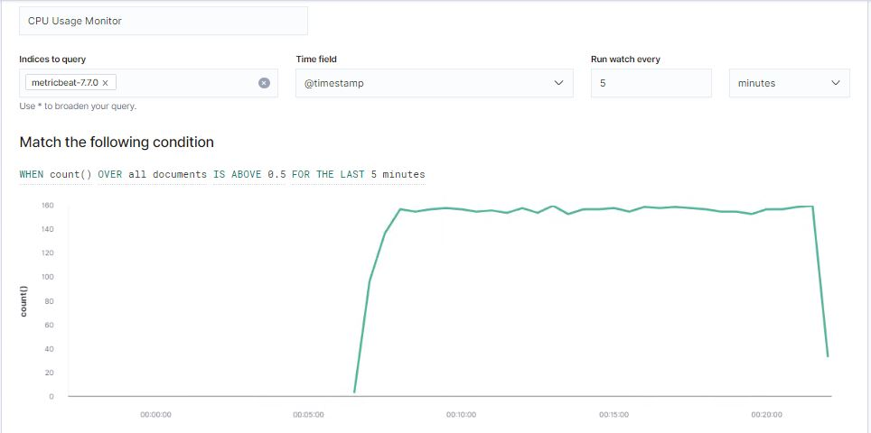
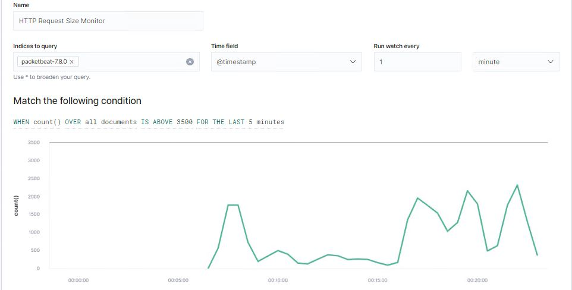

# Blue Team: Summary of Operations

## Table of Contents
- Network Topology
- Description of Targets
- Monitoring the Targets
- Patterns of Traffic & Behavior
- Suggestions for Going Further

### Network Topology

The following machines were identified on the network:
- Name of VM 1: Kali
  - **Operating System**: Linux 5.4.0
  - **Purpose**: Attack Target Machines
  - **IP Address**: 192.168.1.90
  
- Name of VM 2: Capstone
  - **Operating System**: Linux (Ubuntu 18.04.1 LTS)
  - **Purpose**: Used as a testing system for alerts
  - **IP Address**: 192.168.1.100

- Name of VM 3: ELK
  - **Operating System**: Linux (Ubuntu 18.04.1 LTS)
  - **Purpose**: Monitor Targets 1 & 2 using the Beats:
    - Metricbeat
    - Filebeat
    - Packetbeat
  - **IP Address**: 192.168.1.100

- Name of VM 4: Target 1
  - **Operating System**: Linux 3.2-4.9
  - **Purpose**: VM with WordPress web server
  - **IP Address**: 192.168.1.110

- Name of VM 5: Hyper V Manager
  - **Operating System**: Windows 10
  - **Purpose**: VM Manager running the machines listed above
  - **IP Address**: 192.168.1.1

### Description of Targets

The target of this attack was: `Target 1` (***_IP Address: 192.168.1.110_***).

Target 1 is an Apache web server and has SSH enabled, so ports 80 and 22 are possible ports of entry for attackers. As such, the following alerts have been implemented:

- Excessive HTTP Error
- CPU Usage Monitor
- HTTP Request Size Monitor

### Monitoring the Targets

Traffic to these services should be carefully monitored. To this end, we have implemented the alerts below:

#### Excessive HTTP Error

  - **Metric**: Packetbeat: http.response.status_code > 400
  - **Threshold**: http response status code above 400 every 5 minutes
    > When count() GROUPED OVER top5 ‘http.response.status_code’ is above 400 for the last 5 minutes
  
  - **Vulnerability Mitigated**:
    > Intrusion detection/prevention for attacks
    > IPS will block suspicious IP's
    > Implement Account Management measures to require password changes after a specific period of time, require more complex passwords, and lock accounts after repeated unsuccessful login attemps. 
    > Disable Port 22 when possible
   
  - **Reliability**: I would classify this alert as `Medium` reliability as it would not generate a lof of false positives/negatives.

 
#### CPU Usage Monitor

  - **Metric**: Metricbeat: system.process.cpu.total.pct
  - **Threshold**: Maximum CPU total percentage is over 0.5 in 5 minutes
    > WHEN max() OF system.process.cpu.total.pct OVER all documents IS ABOVE 0.5 FOR THE LAST 5 minutes
  - **Vulnerability Mitigated**: This alert will indicate if the CPU's usage is over 50% for 5 minutes or longer which would help with the identification of Virus' or Malwares. 
 
  - **Reliability**: Given that this alert triggers when CPU's usage is above 50% for 5 minutes, it can generate a large number of false positives. Many processes running individually or simultaniously will cause a CPU's usage to be above the threshold. However, it would be considered a `High` reliability alert. 

#### HTTP Request Size Monitor

  - **Metric**: Packetbeat: http.request.bytes
  - **Threshold**: Total number of requested bytes is over 3500 in 1 minute
    > When sum() of http.request.bytes OVER all documents is ABOVE 3500 for the LAST 1 minute 
  - **Vulnerability Mitigated**: Filtering the information by http request bytes will prevent against DDoS attacks. 
  - **Reliability**: This alert would not create many false positive because of the time window at which a DDoS attack occurs. Typically the number of bytes requested during a DDoS would be better measured in seconds, not minutes. Since the alert is configured for a 1 minute time window, the results would be valid. I would rate this alert as `Medium` reliability.

### Suggestions for Going Further

Each alert above pertains to a specific vulnerability/exploit. Recall that alerts only detect malicious behavior, but do not stop it. For each vulnerability/exploit identified by the alerts above, suggest a patch. E.g., implementing a blocklist is an effective tactic against brute-force attacks. It is not necessary to explain _how_ to implement each patch.

The logs and alerts generated during the assessment suggest that this network is susceptible to several active threats, identified by the alerts above. In addition to watching for occurrences of such threats, the network should be hardened against them. The Blue Team suggests that IT implement the fixes below to protect the network:

- Vulnerability 1: Malware and Viruses
  - **Patch**: System Hardening
    >  - Implement Antivirus software
    >  - Implement a Host Based Intrusion Detection System (HIDS)
  
  - **Why It Works**:
    > - Antivirus software is good for identifying, containing, and removing malicious code on the infected system.
    > - HIDS will allow for Intrusion Detection at the Host level 
 
- Vulnerability 2: Brute Force Attacks
  - **Patch**: WordPress Hardening
    > - Limit the listing of `/wp-admin` and `/wp-login` for administrative users only.
    > - Lockout accounts after repeated failed attempts at logging in
 
  - **Why It Works**: 
    > - Locking out user accounts would've been helpful when I used `Jack the Rippert` and `Hydra` to crack the passwords. 
    > - If `/wp-admin` and `/wp-login` were not shown in the table of databeses then I would not have been able to get the password for `Steven`. 

- Vulnerability 3: DDoS prevention and Code Injection
  - **Patch**: DDoS and Code Injection Hardening
    > - Implement a limit on the number of HTTP Requests on the web server
    > - Implement input validation where possible to prevent against malicious code injection. 
    
  - **Why It Works**:
    > - Input validation helps protect against malicious users attempting to gain access to or display information from a webserver.
  
