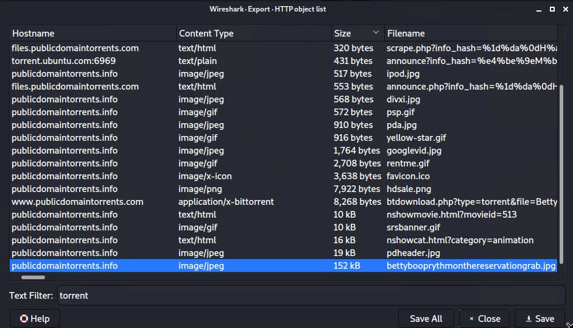
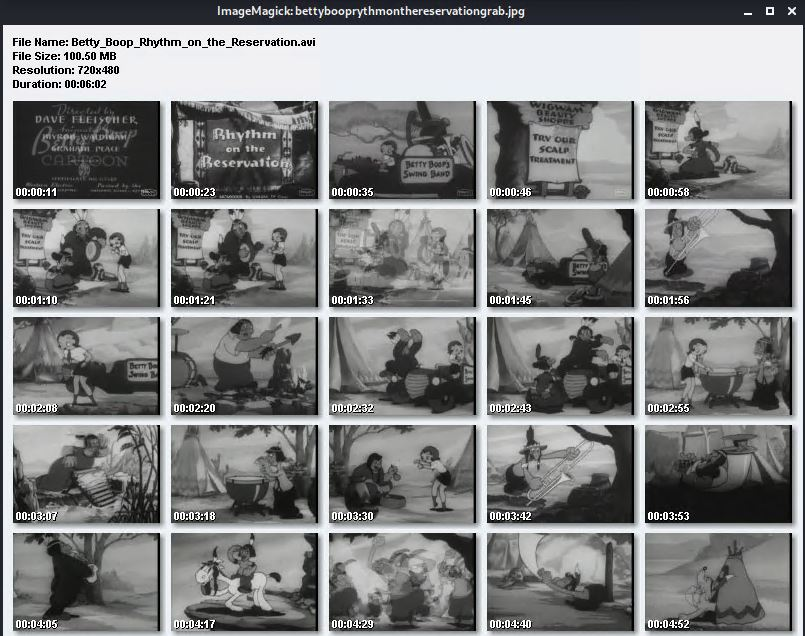

# Network Forensic Analysis Report

Complete this report as you complete the Network Activity on Day 3 of class.

## Time Thieves 
You must inspect your traffic capture to answer the following questions:

1. What is the domain name of the users' custom site?
> Command: `ip.addr == 10.6.12.0/24`
>
> Answer: Using `Network (IP) Address resolution` and then filtering the command above, I noticed that `Frank-n-Ted-DC. frank-n-ted.com` was the domain name of the users' custom site. 

2. What is the IP address of the Domain Controller (DC) of the AD network?
> Answer: The source IP of the Domain Controller of the AD network is: `10.6.12.12`. 

3. What is the name of the malware downloaded to the 10.6.12.203 machine?
> Answer: The name of the Malware downloaded to 10.6.12.203 is `june11.dll`.
> 
> To save the Malware: `File -> Export Objects -> Filter Text "http" -> select june11.dll -> Save.`

4. Upload the file to [VirusTotal.com](https://www.virustotal.com/gui/). 
> 

6. What kind of malware is this classified as?
> Answer: The kind of malware it is `Trojan`. Specifically `Trojan.Mint.Zamg.O`

## Vulnerable Windows Machine

1. Find the following information about the infected Windows machine:
> Command: `ip.addr == 172.16.4.0/24`

   - Host name
   > Answer: `ROTTERDAM-PC`

   - IP address
   > Answer: `172.16.4.205`

   - MAC address
   > Answer: `00:59:07:b0:63:a4`
    
2. What is the username of the Windows user whose computer is infected?
> Command: `p.src == 172.16.4.205 && kerberos.CNameString`
> 
> Answer: `matthijs.devries`

3. What are the IP addresses used in the actual infection traffic?
> Command: `Statistics -> Conversations -> "filter by Packets"`
>
> Answer: The IP's were `185.243.115.84` and `166.62.111.64`. 

4. As a bonus, retrieve the desktop background of the Windows host.
> 

---

## Illegal Downloads

1. Find the following information about the machine with IP address `10.0.0.201`:
    - MAC address
    > Command: `ip.src == 10.0.0.201`
    > Answer: `00:16:17:18:66:c8`

    - Windows username
    > Command: `ip.src == 10.0.0.201 && kerberos.CNameString`
    > Answer: `elmer.blanco`

    - OS version
    > Answer: `BLANCO-DESKTOP Windows NT 10.0`

2. Which torrent file did the user download?
> 
>
> 
