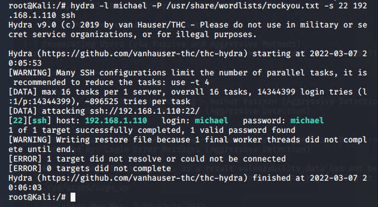

# Red Team: Summary of Operations

## Table of Contents
- Exposed Services
- Critical Vulnerabilities
- Exploitation

### Exposed Services

Nmap scan results for each machine reveal the below services and OS details:

```bash
nmap -sS -A 192.168.1.110
```


This scan identifies the services below as potential points of entry:

`Target 1`

| **PORT** | **Port Status** | **Service** |                    **Version**                   |
|:--------:|:---------------:|:-----------:|:------------------------------------------------:|
| 22/tcp   | open            | ssh         | OpenSSH 6.7 Debian 5+deb8u4 (protocol 2.0)       |
| 80/tcp   | open            | http        | Apache httpd 2.4.10 ((Debian))                   |
| 111/tcp  | open            | rpcbind     | 2-4 (RPC #100000)                                |
| 139/tcp  | open            | netbios-ssn | Samba 3.X - 4.X (workgroup: WORKGROUP)           |
| 445/tcp  | open            | netbios-ssn | Sambra smbd 4.2.14-Debian (workgroup: WORKGROUP) |

The following vulnerabilities were identified on each target:
- `Target 1`
  - [CVE-2021-28041 open SSH](https://nvd.nist.gov/vuln/detail/CVE-2021-28041)
  - [CVE-2017-15710 Apache https 2.4.10](https://nvd.nist.gov/vuln/detail/CVE-2017-15710)
  - [CVE-2017-8779 exploit on open rpcbind port could lead to remote DoS](https://nvd.nist.gov/vuln/detail/CVE-2017-8779) 
  - [CVE-2017-7494 Samba NetBIOS](https://nvd.nist.gov/vuln/detail/CVE-2017-7494)

### Exploitation
- Enumeration and Network Mapping
  - Nmap was used to discover open ports
    - This helped me determine how best to attack the system


- Weak passwords
  - In this case `michael`'s password was `michael`. 
    - A password this simple is easily guessed by a hacker. Guessing this password without using a Brute Forcing method would make it difficult for the defense to detect that it was a malicious user who logged in, rather than Michael. 



- MySQL Database Access
  - Wpscan enumerated users
    - Using SSH with `Michael`'s password above, I was able to access the WordPress database


- MySQL Data Exfiltration
  - I was able to navigate through the database and find multiple important tables such as:
    - `wp_users`
    - `wp_posts`


The Red Team was able to penetrate `Target 1` and retrieve the following confidential data:
- Target 1
  - `flag1.txt`: _TODO: Insert `flag1.txt` hash value_
    - **Exploit Used**
      - _TODO: Identify the exploit used_
      - _TODO: Include the command run_
  - `flag2.txt`: _TODO: Insert `flag2.txt` hash value_
    - **Exploit Used**
      - _TODO: Identify the exploit used_
      - _TODO: Include the command run_
